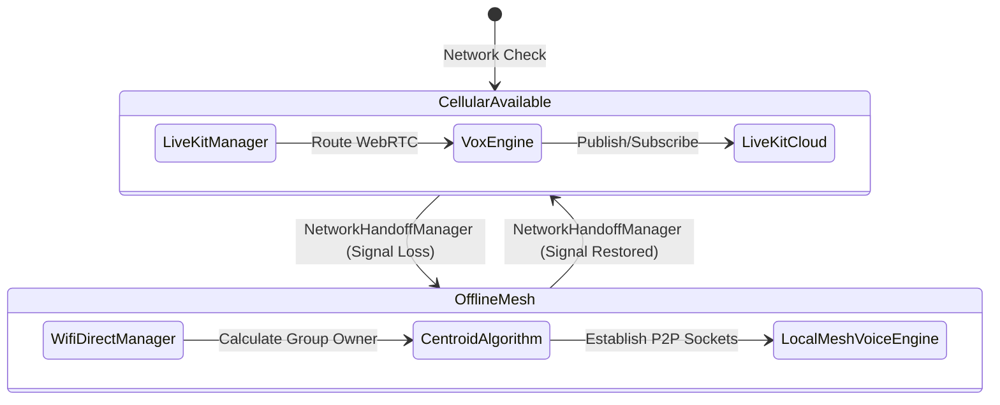
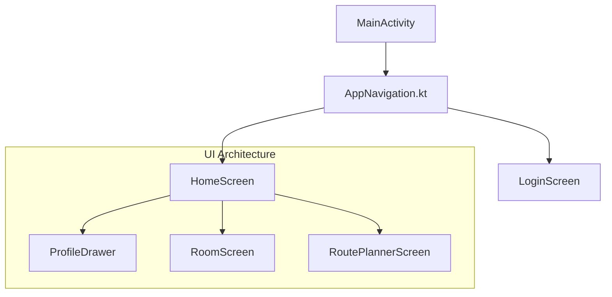

# Rider Voice: Architecture & Engineering Deep Dive

This document provides a highly detailed breakdown of the Rider Voice application's internal file structure, class responsibilities, routing logic, and system architecture.

## 1. The Dual-Engine Voice Architecture

Rider Voice utilizes a hybrid **Dual-Engine** communication model. It seamlessly hands off between a cloud-based Selective Forwarding Unit (SFU) for infinite range and an offline Wi-Fi Direct Mesh for localized mountainous terrain.

### The Brain: `NetworkHandoffManager.kt`
This class monitors Android's `ConnectivityManager`. When the `onLost` callback is triggered (signifying cellular data drop), it:
1. Shuts down `LiveKitManager` and `VoxEngine`.
2. Triggers `WifiDirectManager.initialize()`.
3. Bootstraps the `LocalMeshVoiceEngine`.

---

## 2. The Offline Mesh Coordinator

When operating without cellular data, the app falls back to a 600m Wi-Fi Direct (P2P) network. 

### `WifiDirectManager.kt`
- **Responsibility:** Handles discovery of nearby riders via `WifiP2pManager`.
- **Centroid Election:** Since Wi-Fi Direct uses a "Group Owner" (Hotspot) model, the system must pick the rider who can reach everyone.
- **Algorithm:** The app caches the last known GPS coordinates of the 8 riders. `WifiDirectManager` calculates the geographic centroid (center point) of all riders. The rider closest to the centroid is elected as the Group Owner.
- **Signaling Server:** The elected Group Owner opens a local TCP `ServerSocket` to exchange raw SDP Offers/Answers and ICE Candidates between peers.

### `LocalMeshVoiceEngine.kt`
- **Responsibility:** Bypasses LiveKit entirely and uses Google's raw WebRTC library (`livekit.org.webrtc.*`).
- **Hardware Integration:** Bootstraps `JavaAudioDeviceModule` and forcibly enables hardware Acoustic Echo Cancellation (AEC) and Noise Suppression (NS).
- **Streaming:** Manages a `ConcurrentHashMap` of `PeerConnection` objects for all connected riders on the local IP subnet.

---

## 3. Audio Device Routing & Hardware Compatibility

Motorcycle intercoms (Cardo, Sena) use the Bluetooth Hands-Free Profile (HFP) or Headset Profile (HSP). Android, by default, tries to use A2DP (Media), which causes latency and disables the microphone.

### `AudioDeviceRouter.kt`
- **Responsibility:** Forces the Android OS into VoIP mode (`MODE_IN_COMMUNICATION`).
- **Bluetooth SCO:** Detects if a Cardo or Sena is connected and explicitly calls `audioManager.startBluetoothSco()` and `audioManager.isBluetoothScoOn = true`. 
- **Dynamic Switching:** Listens for `ACTION_HEADSET_PLUG` and `BluetoothProfile.ServiceListener` to switch between a wired Type-C helmet mic and a wireless Cardo unit on the fly without dropping the call.

---

## 4. File Structure Breakdown

### `/app/src/main/java/com/ridervoice/`

#### `/audio` (The Hardware Layer)
*   `AudioDeviceRouter.kt`: Manages Bluetooth SCO and Audio routing.
*   `AudioFocusManager.kt`: Ducks Spotify music when a rider speaks.
*   `VoxEngine.kt`: Voice-Activation Detection (VAD) algorithms.
*   `LocalMeshVoiceEngine.kt`: Offline P2P WebRTC engine.
*   `NetworkHandoffManager.kt`: Switches between Cloud and Offline modes.
*   `HardwarePTTManager.kt`: Listens for Bluetooth media button clicks for Push-to-Talk.

#### `/network` (The Cloud Layer)
*   `LiveKitManager.kt`: Interfaces with the LiveKit SDK for Cellular WebRTC.
*   `ApiService.kt`: Retrofit interfaces for the Node.js backend.

#### `/ui` (The Presentation Layer)
*   `/screens`: Jetpack Compose screens (`HomeScreen.kt`, `RoutePlannerScreen.kt`, `RoomScreen.kt`).
*   `/viewmodels`: Hilt-injected ViewModels that manage state (`RideStatsViewModel`, `HomeViewModel`).
*   `/components`: Reusable UI widgets (`ProfileDrawer.kt`, `TacticalButton.kt`).
*   `/theme`: Modern Android UI/UX styling (`Color.kt`, `Theme.kt`). Includes OLED Black and Glassmorphism.

#### `/services` (The Background Layer)
*   `VoiceForegroundService.kt`: Keeps the microphone alive when the screen is locked.
*   `RideRecorder.kt`: Background location tracker.

#### `/data` (The Persistence Layer)
*   `/local`: Room Database (`RideDatabase.kt`, `Entities.kt`) for offline flight-recorder data.
*   `/repository`: Data orchestration (`SquadRepository.kt`).

---

## 5. UI/UX Architecture

The app uses **Jetpack Compose** and follows a **Single-Activity Architecture** (`MainActivity.kt`). 

State is passed down via `StateFlow` from ViewModels to Composable screens. The UI heavily utilizes **Glassmorphism**, **OLED Blacks**, and **Neon Accents** for a high-visibility HUD aesthetic designed for riders under direct sunlight.
