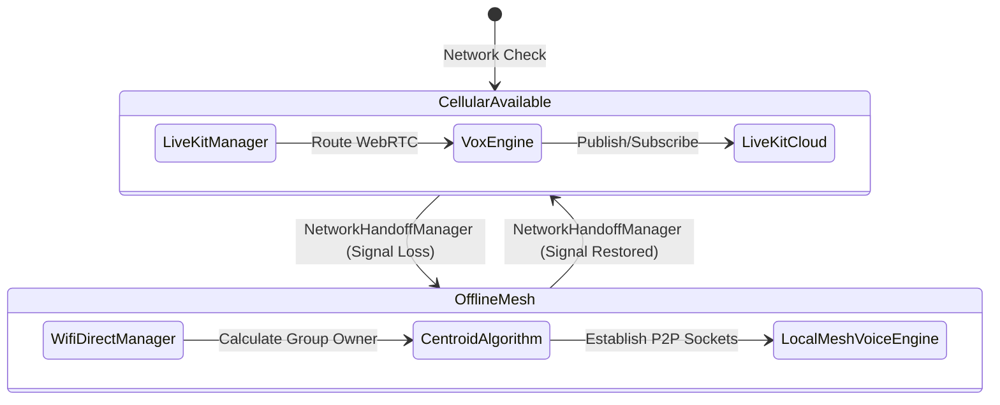

# Rider Voice

Rider Voice is a hyper-premium, real-time communication system and mobile application tailored for motorcycle riders. It provides active voice communications, real-time route planning, and ride statistics.

## Dual-Engine Intercom Architecture
Rider Voice utilizes a hybrid **Dual-Engine** communication model. It seamlessly hands off between a cloud-based Selective Forwarding Unit (SFU) for infinite range and an offline Wi-Fi Direct Mesh for localized mountainous terrain where cell service drops.

## Core Features
- **Failproof Comms**: The Dual-Engine architecture guarantees connection whether you are on a 5G highway or in an offline mountain pass.
- **Centroid Mesh Routing**: Automatically calculates the geographic center of the squad and elects the middle rider to act as the Wi-Fi Direct router to maximize range.
- **Universal Hardware Support**: Custom Bluetooth SCO routing ensures compatibility with Cardo, Sena, and standard Type-C wired helmet intercoms.
- **Audio Ducking**: Automatically fades your Spotify music into the background when a squad member speaks.
- **Flight Recorder**: Real-time graphing and local Room Database recording of speed, total distance, and elevation.

## Documentation
- For a deep dive into the file structure, classes, and logic, read the [ARCHITECTURE.md](ARCHITECTURE.md) guide.

## Getting Started
1. Open the `/mobile-app` folder in Android Studio (do **not** open the root monorepo folder).
2. Ensure you have added your `google-services.json` file for Firebase Authentication support.
3. Sync Gradle and build the project.
4. Run the app on a physical Android device for accurate Bluetooth and WebRTC testing.
